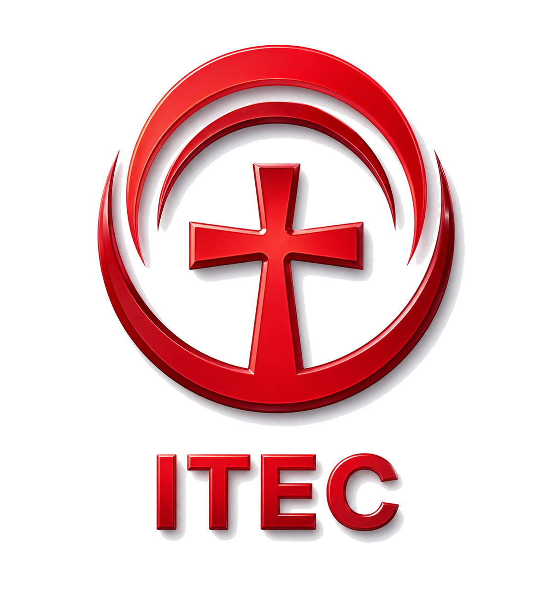

# ITEC EAD — Plataforma de Formação Teológica

<p align="center">
  
</p>

<p align="center">
  <strong>Instituto de Teologia Cristã</strong><br/>
  Formação teológica de excelência · Modalidade Híbrida (Presencial e Online)<br/>
  Unidade Janga · Paulista-PE · Fundado em 2025
</p>

<p align="center">
  <a href="https://www.itecedu.com">itecedu.com</a> ·
  <a href="https://itec-ead.vercel.app">Staging</a> ·
  <a href="https://instagram.com/itec.teologia">@itec.teologia</a>
</p>

---

## Stack

| Camada | Tecnologia |
|---|---|
| Frontend | React 18 + TypeScript + Vite |
| Estilização | Tailwind CSS + Shadcn UI (Radix) |
| Backend / Auth / DB | Supabase (PostgreSQL + RLS + Storage) |
| Deploy | Vercel (CD automático via GitHub) |
| Roteamento | React Router DOM v6 |
| Formulários | React Hook Form + Zod |
| Gráficos | Recharts |
| Ícones | Lucide React |

---

## Configuração local

### Pré-requisitos
- Node.js >= 18 (LTS)
- pnpm >= 9 (`npm install -g pnpm`)
- Conta no [Supabase](https://supabase.com)

### 1. Clone e instale

```bash
git clone https://github.com/heliopaivajr/itec-ead.git
cd itec-ead
pnpm install
```

> ⚠️ **Use sempre `pnpm`**, não `npm` ou `yarn`. O projeto usa `pnpm-lock.yaml` e instalar com outro gerenciador quebra o lockfile do Vercel.

### 2. Variáveis de ambiente

Copie o arquivo de exemplo e preencha com suas credenciais do Supabase:

```bash
cp .env.example .env
```

Edite o `.env`:

```env
VITE_SUPABASE_URL=https://SEU_PROJETO.supabase.co
VITE_SUPABASE_ANON_KEY=sua_anon_key_aqui
```

> As credenciais ficam em **Supabase Dashboard → Settings → API**.
> O arquivo `.env` está no `.gitignore` — **nunca commitar**.

### 3. Configure o Supabase

Execute os scripts SQL no **SQL Editor do Supabase Dashboard** (nesta ordem):

```
.prd/01_handle_new_user_trigger.sql   ← trigger de criação de perfil
.prd/02_profiles_rls.sql              ← políticas RLS da tabela profiles
.prd/supabase/migration_sprint3_avisos.sql  ← tabela de avisos
```

### 4. Rode o servidor de desenvolvimento

```bash
pnpm dev
```

Acesse: `http://localhost:8080`

---

## Scripts disponíveis

```bash
pnpm dev          # Servidor de desenvolvimento
pnpm build        # Build de produção
pnpm build:dev    # Build em modo development
pnpm preview      # Preview do build local
pnpm lint         # ESLint
```

---

## Estrutura do projeto

```
itec-ead/
├── public/
│   ├── logo_itec_transparent.png   # Logo sem fundo (usada no site)
│   ├── logo_itec.png               # Logo original
│   ├── og-image.png                # Imagem OG para WhatsApp/redes (1200×630)
│   ├── favicon.ico
│   ├── robots.txt
│   └── videos/                     # Vídeos servidos pelo site
│       ├── hero-bg.mp4             # Vídeo de fundo do Hero
│       ├── v01.mp4 → v05.mp4       # Vídeos do carrossel (seção ITEC em vídeo)
│
├── src/
│   ├── pages/
│   │   ├── Index.tsx               # Landing page principal
│   │   ├── Login.tsx               # Login (Email + Google OAuth)
│   │   ├── Cadastro.tsx
│   │   ├── RecuperarSenha.tsx
│   │   ├── Cursos.tsx              # Lista dos 3 cursos
│   │   ├── Professores.tsx
│   │   ├── Sobre.tsx               # Nossa Missão
│   │   ├── Docentes.tsx            # Corpo docente
│   │   ├── Contato.tsx
│   │   ├── Comunidade.tsx
│   │   ├── Blog.tsx
│   │   ├── ReservarVaga.tsx        # Formulário de interesse + LGPD
│   │   ├── NotFound.tsx
│   │   ├── DevSetup.tsx            # Só em desenvolvimento
│   │   ├── Dashboard.tsx           # Layout base do dashboard
│   │   └── dashboard/
│   │       ├── DashboardHome.tsx   # KPIs por role
│   │       ├── Perfil.tsx
│   │       ├── Leads.tsx
│   │       ├── Usuarios.tsx
│   │       ├── MeusCursos.tsx
│   │       ├── Matriculas.tsx
│   │       ├── CursosAdmin.tsx
│   │       ├── Avisos.tsx
│   │       └── ComingSoon.tsx
│   │
│   ├── components/
│   │   ├── Hero.tsx                # Hero com vídeo bg + animações
│   │   ├── Navbar.tsx
│   │   ├── Footer.tsx
│   │   ├── VideoReel.tsx           # Carrossel estilo Netflix
│   │   ├── Features.tsx
│   │   ├── CoursePreview.tsx
│   │   ├── Testimonials.tsx
│   │   ├── CallToAction.tsx
│   │   └── ui/                     # Shadcn UI components
│   │
│   ├── lib/
│   │   └── supabase.ts             # Client Supabase (usa VITE_*)
│   │
│   ├── data/
│   │   └── courses.ts              # Dados dos 3 cursos
│   │
│   └── hooks/
│       ├── use-profile.ts
│       └── use-theme-mode.ts
│
├── .prd/                           # Documentação do projeto
│   ├── prd.md                      # PRD principal (checklist completo)
│   └── _archive/                   # Histórico de decisões
│
├── .env.example                    # Template de variáveis (commitar ✅)
├── .env                            # Credenciais reais (NÃO commitar 🚫)
├── vercel.json                     # Cache + security headers
├── vite.config.ts                  # manualChunks + aliases
├── tailwind.config.ts
└── index.html                      # Meta tags OG, fontes, title
```

---

## Roles do sistema

| Role | Quem | Acesso |
|---|---|---|
| `pendente` | Novo cadastro | Área de espera |
| `aluno` | Aluno aprovado | Área do aluno |
| `professor` | Docente | Lançar notas, frequência, materiais |
| `administracao` | Secretaria | Leads, matrículas, avisos |
| `admin` | Diretoria | Todos os painéis |
| `superadmin` | Dev (Hélio) | Acesso total + LGPD + auditoria |

---

## Cursos oferecidos

| Curso | Duração | Horário | Modalidade |
|---|---|---|---|
| Graduação em Teologia | 3 anos / 185 créditos | Seg, Qua, Sex — 18h45 | Híbrida |
| SETEB | 3 anos | Terças — 19h às 20h | Presencial |
| Ministerial para Mulheres | Anual (7 disciplinas) | Quintas — 19h às 22h | Presencial |

---

## O que está em produção

- ✅ Landing page completa com vídeo de fundo e animações
- ✅ Carrossel de vídeos estilo Netflix (5 vídeos)
- ✅ Formulário de reserva de vaga com LGPD
- ✅ Páginas: /sobre, /docentes, /contato, /comunidade, /blog
- ✅ Dashboard com painéis por role
- ✅ Auth com Email + Google OAuth (Supabase)
- ✅ Leads, Matrículas, Avisos, Usuários
- ✅ Tema Dark / Light / Sépia
- ✅ Deploy automático Vercel + domínio itecedu.com

## Próximos passos

- [ ] FAQ na landing page
- [ ] E-mail automático ao reservar vaga (Resend)
- [ ] Tabelas acadêmicas no Supabase (cursos, módulos, aulas)
- [ ] MeusCursos com progresso real
- [ ] Frequência e Notas
- [ ] Certificados digitais com QR Code
- [ ] Financeiro / Mensalidades

---

## Contatos

| | |
|---|---|
| Site | https://www.itecedu.com |
| Secretaria | secretaria@itecedu.com |
| Financeiro | financeiro@itecedu.com |
| Coordenação | educacao@itecedu.com |
| WhatsApp | (81) 99116-1448 |
| Instagram | [@itec.teologia](https://instagram.com/itec.teologia) |

---

> Desenvolvido para o **Instituto de Teologia Cristã — ITEC**  
> Unidade Janga · Paulista-PE · itecedu.com
